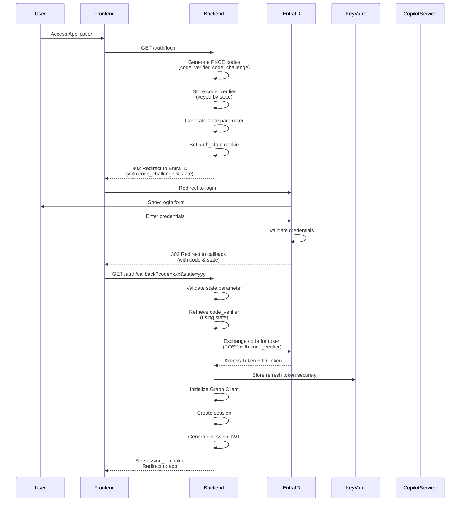
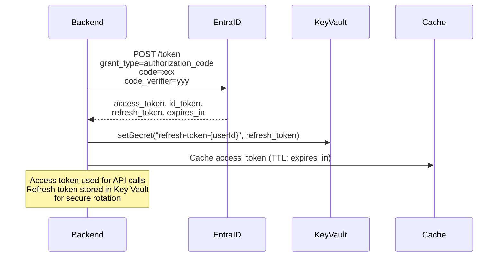
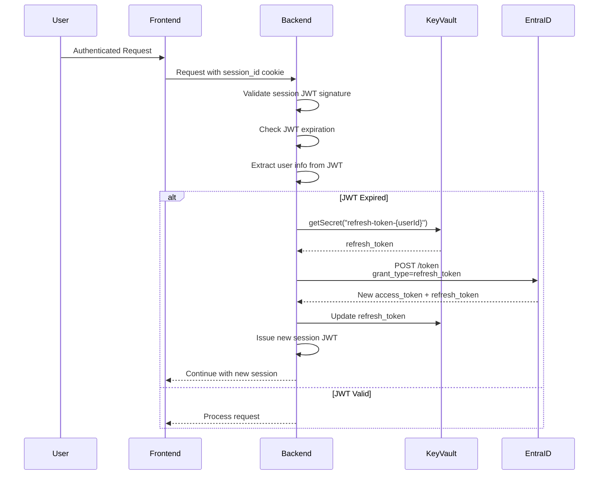
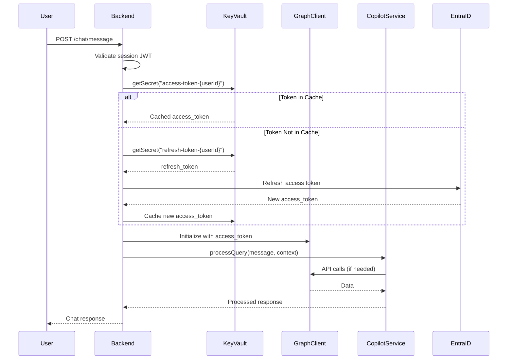
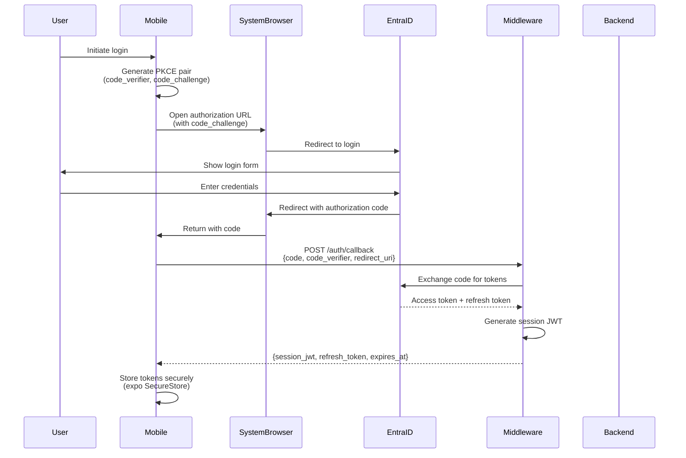
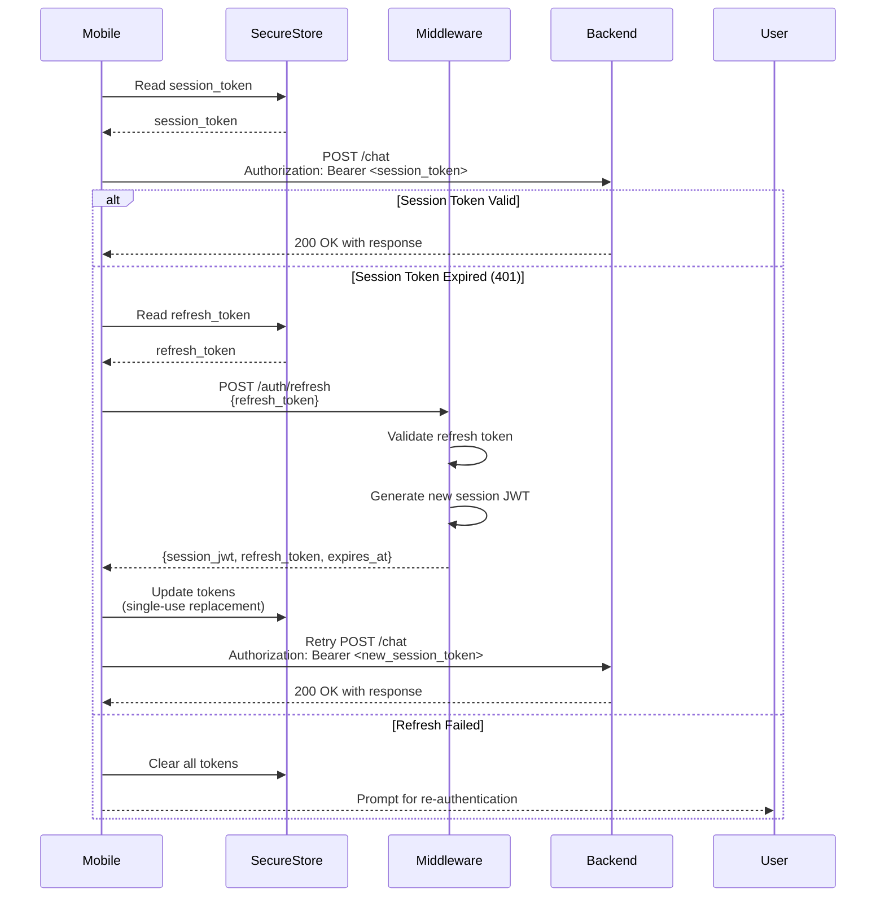

# Authentication Architecture

## Overview

This document describes the authentication architecture for Version 5 Chatbot App, including PKCE flow, token exchange, session management, and backend-to-Copilot service integration.

## Authentication Flow

The application uses Microsoft Entra ID OIDC (OpenID Connect) with PKCE (Proof Key for Code Exchange) for secure authentication.

## PKCE Flow Sequence Diagram



## Token Exchange Sequence



## Session JWT Management



## Backend to Copilot Service Integration



## Security Considerations

### PKCE Implementation

- **Code Verifier**: Cryptographically random string (43-128 characters)
- **Code Challenge**: SHA256 hash of code verifier (base64url encoded)
- **Storage**: Code verifier stored server-side, keyed by state parameter
- **Validation**: State parameter validated on callback to prevent CSRF

### Token Storage

- **Access Tokens**: Cached in-memory with TTL (never logged)
- **Refresh Tokens**: Stored in Azure Key Vault (encrypted at rest)
- **Session JWTs**: Signed with HS256, stored in HTTP-only cookies

### Secret Management

- All secrets retrieved from Azure Key Vault in production
- Fallback to environment variables in development
- Secrets never exposed in logs or error messages
- Automatic rotation supported via Key Vault

## API Endpoints

### Authentication Endpoints

- `GET /auth/login` - Initiates PKCE flow
- `GET /auth/callback` - Handles OIDC callback
- `POST /auth/logout` - Invalidates session

### Protected Endpoints

All chat endpoints require valid session:
- `POST /chat/message` - Send message
- `GET /chat/history` - Get chat history
- `DELETE /chat/session` - Clear session

## Configuration

### Required Environment Variables

```bash
AZURE_CLIENT_ID=<app-registration-client-id>
AZURE_TENANT_ID=<azure-ad-tenant-id>
AZURE_KEY_VAULT_URL=https://<vault-name>.vault.azure.net/
AZURE_REDIRECT_URI=https://your-app.com/auth/callback
SESSION_SIGNING_KEY=<secret-key-min-32-characters-for-hs256-jwt-signing>
```

### Key Vault Secrets

- `azure-client-secret` - Application client secret
- `refresh-token-{userId}` - Per-user refresh tokens
- `signing-key` - JWT signing key (optional, can use HS256 with env var)

## Session Management

### Session JWT Structure

```json
{
  "userId": "user-id-from-entra-id",
  "sessionId": "session-uuid",
  "exp": 1234567890,
  "iat": 1234567890,
  "iss": "version-5-chatbot-app"
}
```

### Cookie Configuration

- **Name**: `session_id`
- **HttpOnly**: true (prevents XSS)
- **Secure**: true (HTTPS only in production)
- **SameSite**: strict (prevents CSRF)
- **MaxAge**: 3600 seconds (1 hour)

## Mobile App Session Token Flow

The mobile app uses Authorization Code + PKCE flow to obtain session JWTs from the middleware, stores them securely, and includes them in API requests.

### Mobile PKCE Flow Sequence



### Mobile Session Management



### Mobile Token Storage

- **Session JWT**: Stored in `expo-secure-store` with key `session_jwt`
- **Refresh Token**: Stored in `expo-secure-store` with key `refresh_token`
- **Expiration**: Stored in `expo-secure-store` with key `session_exp` (timestamp in milliseconds)
- **Security**: All tokens stored using Expo SecureStore (encrypted storage, keychain on iOS, Keystore on Android)

### Mobile API Integration

The mobile app uses an `authenticatedFetch` wrapper that:
1. Automatically adds `Authorization: Bearer <session_token>` header to requests
2. Detects 401 Unauthorized responses
3. Automatically refreshes the session token using the stored refresh token
4. Retries the original request with the new session token
5. Handles single-use refresh token replacement (middleware returns new refresh_token)
6. Clears session on refresh failure and prompts for re-authentication

### Mobile Configuration

Required environment variables (set in `mobile/.env` or `app.json`):
```bash
EXPO_PUBLIC_BACKEND_URL=https://your-middleware.com
EXPO_PUBLIC_ENTRA_CLIENT_ID=<app-registration-client-id>
EXPO_PUBLIC_ENTRA_TENANT_ID=<azure-ad-tenant-id>
EXPO_PUBLIC_ENTRA_SCOPES=openid,profile,offline_access
```

**Note**: The mobile app does NOT store client secrets. All authentication uses PKCE flow which does not require client secrets.

## Token Refresh Strategy

### Web/Backend
1. Access tokens cached with expiration time
2. On expiration, refresh token retrieved from Key Vault
3. New access token obtained from Entra ID
4. New access token cached
5. Refresh token updated in Key Vault if rotated

### Mobile
1. Session JWT stored in SecureStore with expiration
2. On 401 response, refresh token retrieved from SecureStore
3. Refresh token sent to middleware `/auth/refresh` endpoint
4. Middleware validates and returns new session JWT + refresh token
5. New tokens stored in SecureStore (single-use replacement)
6. Original request retried with new session JWT

## Error Handling

All authentication errors:
- Never expose tokens or secrets
- Use generic error messages in production
- Log detailed errors server-side (sanitized)
- Return appropriate HTTP status codes

## Middleware-Side Authoritative Identity Processor

The middleware serves as the authoritative identity processor for Microsoft Entra ID OIDC authentication. The `verifySession` middleware validates session JWTs on protected routes (e.g., `/chat`), ensuring that all requests are authenticated before processing. Session JWTs are issued with a 15-minute TTL (Time To Live) and are signed using HS256 with the `SESSION_SIGNING_KEY`. Refresh tokens are single-use tokens stored in a process-scoped in-memory map, mapping refresh tokens to user subjects. When a refresh token is used to obtain a new session JWT, the old refresh token is invalidated and a new one is issued, providing secure token rotation without requiring persistent storage.

## Compliance

- **OIDC 1.0** compliant
- **PKCE RFC 7636** compliant
- **OWASP** security guidelines followed
- **GDPR** compliant (no PII in logs)
